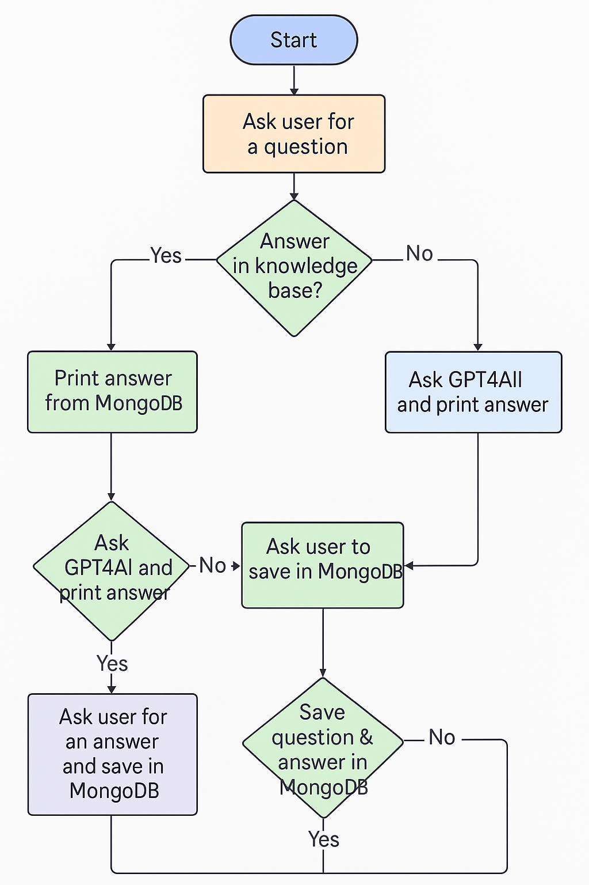
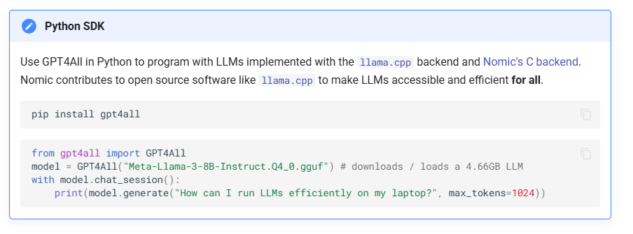

# Personal Chat Assistant with Memory

### Assistant Chatbot - Using MongoDB for Knowledge Base

---

### Project Goal

Build a **local terminal-based chatbot** that:

1. Answers questions based on a **MongoDB knowledge base**
2. Uses **matching** to handle variations in questions
3. If no answer is found:
    - Optionally uses **GPT4All** to generate a reply (offline)
4. **Saves** new Q&A to MongoDB so it improves over time
5. **Bonus** - Wrap it in to a Flask App / Connect to Telegram and Use. 

<aside>
🧘🏾‍♂️

You can use it through the course to be your offline assistant 

</aside>

---

### Logic Breakdown



### Workflow Example

```
You: What is a variable?
📚 Found in DB: A variable stores data.
You: What is a generator?
🤖 Not found. Asking GPT4All...
AI: A generator is a function that uses 'yield' to return values one at a time.
💾 Save to DB? (y/n): y
✅ Saved!
```

```
👋 Welcome to your MongoDB-powered Student Assistant. Type 'exit' to quit.

**You:** What is a python decorator ? 
**Bot:** 🤔 I don't know that... asking GPT4All locally...
**AI:** In Python, a **decorator** is a special kind of function that can modify or extend the behavior of another function. A decorator is a small piece of code that "wraps" around another function, allowing you to add new functionality without modifying the original function.

A decorator typically takes in one argument: the function it's supposed to decorate (also known as the **target**). The decorator returns a new function that "calls back" into the target function. This allows the decorator to modify or extend the behavior of the target function before, after, or instead of its original execution.

Here is an example:
```
def my_decorator(func):
    def wrapper():
        print("Something is happening before the function is called.")
        func()
        print("Something is happening after the function is called.")
    return wrapper

@my_decorator
def say_hello():
    print("Hello!")

say_hello()  # Output: Something is happening before the function is called.
           #          Hello!
Save this answer to MongoDB? (y/n): y
✅ Saved!
**You:** What is a python decorator ? 
**Bot:** In Python, a **decorator** is a special kind of function that can modify or extend the behavior of another function. A decorator is a small piece of code that "wraps" around another function, allowing you to add new functionality without modifying the original function.

A decorator typically takes in one argument: the function it's supposed to decorate (also known as the **target**). The decorator returns a new function that "calls back" into the target function. This allows the decorator to modify or extend the behavior of the target function before, after, or instead of its original execution.

Here is an example:
```
def my_decorator(func):
    def wrapper():
        print("Something is happening before the function is called.")
        func()
        print("Something is happening after the function is called.")
    return wrapper

@my_decorator
def say_hello():
    print("Hello!")

say_hello()  # Output: Something is happening before the function is called.
           #          Hello!
**You:** 
```

---

## Project Structure

```
student_assistant_chatbot/
├── chatbot.py            # Main chatbot logic
├── db.py                 # MongoDB connection and helpers
├── ai_integration.py     # GPT4All integration
├── README.md             # With Reflections ! 
```

---

## Requirements

- GPT4All - https://www.nomic.ai/gpt4all



- Make sure its Working First, Read the docs on usage etc. (Its a large File)

Install MongoDB driver:

```bash
pip install pymongo
```

---

## MongoDB Setup (Local or Atlas)

- **Database**: `student_bot`
- **Collection**: `knowledge_base`
- Each document:

```json
{
  "question": "What is a variable in Python?",
  "answer": "A variable stores data that can be used later."
}
```


---

## `db.py`

```python
from pymongo import MongoClient

def db_init():
    # To-Do: 
    # 1. Connect to Mongo (Atlas or Local)
    # 2. Create/Connect to a DB and a Collection
    # 3. Return the Collection for use later 

def find_answer(question, collection):
    # To-Do: 
    # 1. Find the Question in the Collection
    # 2. Return The result if found something, else return None

def check_similar_question(question, collection):
    # To-Do: 
    # 1. Find if the Question is already in the Collection
    # 2. Return The result if found something, else return None

def add_question(question, answer, collection):
    # To-Do: 
    # 1. Insert a Question and Answer into the DB
    # 2. Return/Print a Success Message

```

## `ai_integration.py`

```python
from gpt4all import GPT4All

model = GPT4All("Meta-Llama-3-8B-Instruct.Q4_0.gguf", device="cpu")

def ask_local_ai(question):
    with model.chat_session():
        return model.generate(question, max_tokens=200).strip()

print(ask_local_ai("What is the capital of France?")) # This is just to Test
```

## `chatbot.py`

```python
from db import find_answer, check_similar_question, add_question, db_init
from ai_integration import ask_local_ai

# Initialize DB connection
collection = db_init()

print("\U0001F44B Welcome to your MongoDB-powered Student Assistant. Type 'exit' to quit.\n")

while True:

# To-Do:
# 1. Take User Input as a Question, Store in a variable. 
# 2. If user input is 'exit' = break the loop. 
# 3. Try to see if the Question is in the DB already, if it is - Show the answer. 
# 4. If the Question is insnt in the DB - Go ask the LLM and show the response.
# 5. Ask user if they want to save AI's answer to DB
# 6. If user wants to save:
#       Add question-answer pair to MongoDB
# 
# 7. If user doesn't want to save:
#      Notify user about missing answer
    
#      ***Bonus***
#      Ask if user wants to add custom answer
#      If user wants to add:
#      Get custom answer from user
#      Add custom answer to MongoDB

#      Return to start of loop for next question
```


---

## Test Questions You Can Insert Manually

```python
# In a Python shell or setup script:
from db import add_question
add_question("What is a loop?", "A loop allows repeated execution of code.")
add_question("What is yield?", "It turns a function into a generator.")
```