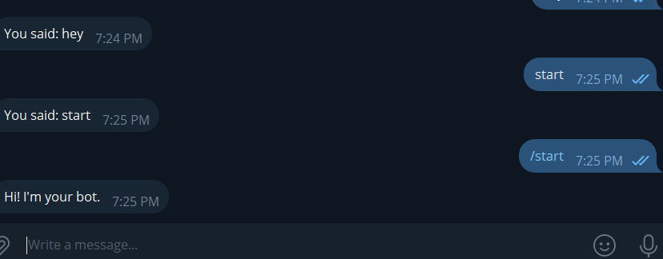

# Class Project: Telegram Bot

## Project Goal

Build a **Telegram bot** in Python that will make our API calls

---

## Requirements

1. Python 3.8+
2. Telegram account and bot token (created via @BotFather)
3. `python-telegram-bot` library
4. Read - https://tjtanjin.medium.com/how-to-build-a-telegram-bot-a-beginners-step-by-step-guide-c671ce027c55
5. Visit - https://python-telegram-bot.org/

---

## Step-by-Step Instructions

### 1. Install Python Package

```bash
pip install python-telegram-bot==13.15
# This is the version im using - its old but will make it easy for you to start, you can use another one if you like - syntax might be diffrent (read the docs to implement)! 
```

---

### 2. Create Your Telegram Bot

1. Open Telegram and start a chat with `@BotFather`
2. Type `/newbot` and follow the prompts
3. Save the token provided


---

### Start with a simple Python Script: `bot.py`

```python
from telegram.ext import Updater, CommandHandler, MessageHandler, Filters

TOKEN = 'YOUR_TOKEN'

def start(update, context):
    update.message.reply_text("Hi! I'm your bot.")

def echo(update, context):
    update.message.reply_text(f"You said: {update.message.text}")

def main():
    updater = Updater(TOKEN, use_context=True)
    dp = updater.dispatcher

    dp.add_handler(CommandHandler("start", start))
    dp.add_handler(MessageHandler(Filters.text & ~Filters.command, echo))

    updater.start_polling()
    updater.idle()

if __name__ == '__main__':
    main()
```

---

### Run the Bot and Test it !

```bash
python3 bot.py
```




---

### Now for the fun part !

- Copy this file, start writing the functions to make the api calls !

```python
from telegram.ext import Updater, CommandHandler, MessageHandler, Filters

TOKEN = 'YOUR_TOKEN'

def start(update, context):
    update.message.reply_text("Hi! I'm your bot.")

def echo(update, context):
    update.message.reply_text(f"You said: {update.message.text}")

# Exercise 1: Get the repositores of a user in github via api calls to github api
def get_repos(update, context, username):
    # TODO: Get the repositores of a user in github via api calls to github api
    pass

#2. Add a command to get the top 10 repositores in github via api calls to github api
def get_top_10_repos(update, context):
    # TODO: Get the top 10 repositores in github via api calls to github api
    pass

#3. Add a commad to get how many branches a repo has via api calls to github api
def get_branches(update, context, repo_name):
    # TODO: Get how many branches a repo has via api calls to github api
    pass

#4. Check if a GitHub repo has open issues and how many.
def get_open_issues(update, context, repo_name):
    # TODO: Get how many open issues a repo has via api calls to github api
    pass

#5. Check if a GitHub repo has open pull requests and how many.
def get_open_pull_requests(update, context, repo_name):
    # TODO: Get how many open pull requests a repo has via api calls to github api
    pass    

#6. Add a /weather <city> command→ Use OpenWeatherMap API to return current weather.
def get_weather(update, context, city):
    # TODO: Get the weather of a city via api calls to OpenWeatherMap API
    pass

#7. Add a /joke command → Use https://official-joke-api.appspot.com/random_joke API to return a random joke.
def get_joke(update, context):
    # TODO: Get a random joke via api calls to https://official-joke-api.appspot.com/random_joke API
    pass

def main():
    updater = Updater(TOKEN, use_context=True)
    dp = updater.dispatcher

    dp.add_handler(CommandHandler("start", start))
    dp.add_handler(MessageHandler(Filters.text & ~Filters.command, echo))

    updater.start_polling()
    updater.idle()

if __name__ == '__main__':
    main()

```

### It Should look like that:


## **Q&A**

- **Q: How do I know what is the URL I need to send the API request to?**
    
    **A:** Visit the GitHub API docs here – [GitHub REST API Docs](https://docs.github.com/en/rest/repos?apiVersion=2022-11-28). You’ll find the base URL, required parameters, and example requests.
    

---

- **Q: How do I call a function from the Telegram bot?**
    
    **A:**
    
    ```python
    dp.add_handler(CommandHandler("function_name", function_name))  # Inside main()
    ```
    
    Then run the command in chat like this:
    
    ```
    /function_name
    ```
    

---

- **Q: How do I pass arguments to a Telegram bot command?**
    
    **A:** Use the `context.args` list:
    
    ```python
    def my_command(update, context):
        args = context.args
        if args:
            update.message.reply_text(f"You sent: {args[0]}")
        else:
            update.message.reply_text("Please provide an argument.")
    ```
    

---

- **Q: How do I make an API call in Python?**
    
    **A:**
    
    ```python
    import requests
    
    response = requests.get("https://api.github.com/users/dor-amar/repos")
    data = response.json()
    print(data)
    ```
    
- **Q: How can I read and use the JSON data returned from an API?**
    
    **A:**