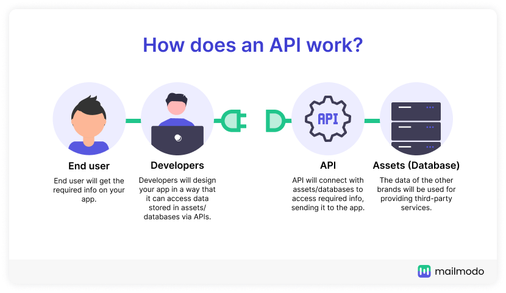
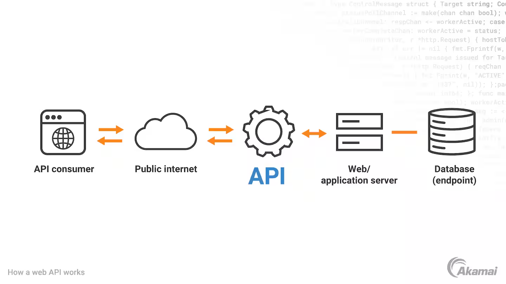

# What is an API ?



### **What is an API?**

An **API** (Application Programming Interface) is like a **messenger** that allows different programs or systems to communicate with each other and exchange information.

---

### **Simple Analogy**

Imagine you're at a restaurant:

1. You look at the menu and decide what you want.
2. You tell the waiter your order.
3. The waiter takes your request to the kitchen.
4. The kitchen prepares the food and gives it to the waiter.
5. The waiter brings the food to you.

In this example:

- **You** are the application (or user).
- **The waiter** is the API.
- **The kitchen** is the system (or server) where the request is processed.

The API (waiter) handles your request and brings back a response without you needing to know how the kitchen works.



---

### **In Technical Terms**

1. **API**: A set of rules that programs follow to interact with each other.
2. **Request**: You send a request to the API asking for information or to perform a task.
3. **Response**: The API returns the data or performs the action you requested.

---

### **Example in Everyday Life**

1. **Weather App**: When you check the weather on your phone, the app uses an API to get weather data from a server.
2. **Google Maps**: Apps like Uber use Google Maps' API to show locations and routes.
3. **Social Media**: When you share a Spotify song on Instagram, an API connects Spotify with Instagram.

---

### **Key Features of an API**

1. **Connects Systems**: It allows one program to talk to another.
2. **Simplifies Use**: You don't need to know how the system works internally.
3. **Reusable**: APIs can be used by different programs for the same purpose.

---

### **Real-Life Python Example**

Suppose we use a weather API to get the current temperature in a city:

```python
import requests

# Sending a request to the weather API
response = requests.get("https://api.weatherapi.com/v1/current.json?key=YOUR_API_KEY&q=London")

# Parsing the response
data = response.json()
print("Temperature in London:", data['current']['temp_c'], "°C")

```

---

### **In Simple Words**

An API is like a bridge or waiter that helps two programs talk to each other, making it easier for you to get data or perform tasks without worrying about the technical details.

---
## Navigation

[⬅️ Previous: if **name** == "**main**"](modules.md) | [Next: Working with APIs in Python ➡️](working-with-api.md)
