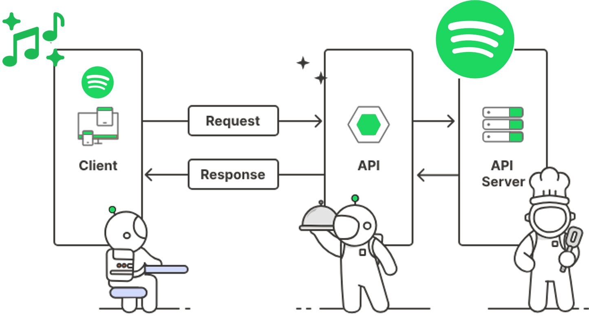

# Working with APIs in Python



### **1. Introduction to APIs**

- **What is an API?**
    - API stands for Application Programming Interface. It’s a way for different software applications to communicate with each other.
    - APIs allow you to interact with external services and retrieve or send data.
- **Types of APIs**
    - **REST (Representational State Transfer)**: The most common type, typically uses HTTP requests (GET, POST, PUT, DELETE).
    - **SOAP (Simple Object Access Protocol)**: A protocol for exchanging structured information, less commonly used nowadays.
    - **GraphQL**: A query language for APIs, allows clients to request specific data.

### **2. Making HTTP Requests**

- **HTTP Methods**:
    - **GET**: Retrieve data from an API.
    - **POST**: Send data to an API (e.g., to create a new resource).
    - **PUT**: Update data on an API.
    - **DELETE**: Delete data on an API.
- **Using the `requests` Library**:
    - Python’s `requests` library makes it easy to send HTTP requests.
    
    ```python
    import requests
    ```
    

### **3. Basic GET Request**

- **Making a GET Request**:
    
    ```python
    response = requests.get('https://randomfox.ca/floof')
    print(response.status_code)  # Check the status code (e.g., 200 for success)
    print(response.json())  # Parse the response as JSON
    
    ```
    
- **Handling Query Parameters**:
    
    ```python
    params = {'key1': 'value1', 'key2': 'value2'}
    response = requests.get('https://randomfox.ca/floof', params=params)
    print(response.url)  # See the full URL with parameters
    
    ```
    

## 3. Practical Examples

### **Example 1: Fetching a Random Joke**

You can use the exact code and explanation from the PDF:

```python
import requests

url = 'https://official-joke-api.appspot.com/jokes/random'

response = requests.get(url)
joke = response.json()

print(joke['setup'], joke['punchline'])
```

**Explanation**:

- Walk your students through how this code uses the `requests.get()` method to make a GET request to a joke API and then parses the response using `.json()` to extract and print the joke.

**Output**:

- Example: "Why don't scientists trust atoms? Because they make up everything."

### **Example 3: GitHub API**

Finally, use the GitHub API example to show how to interact with a real-world API that many students may have heard of:

```python
import requests

url = "https://api.github.com/repos/microsoft/vscode/issues"
response = requests.get(url)
issues = response.json()

for issue in issues:
    print(issue['title'])
```

**Explanation**:

- Walk them through how this example fetches issues from the Visual Studio Code repository on GitHub and prints their titles.

### **Example: Checking the Status Code**

```python
import requests

# Define the URL for the API endpoint
url = "https://api.github.com/repos/python/cpython"

# Make a GET request to the API
response = requests.get(url)

# Check the status code of the response
if response.status_code == 200:
    print("Success! The request was successful.")
    data = response.json()
    print(f"Repository: {data['name']}")
    print(f"Description: {data['description']}")
else:
    print(f"Failed to retrieve data. Status code: {response.status_code}")

```

### **Explanation**:

1. **Import the requests library**: This library allows you to send HTTP requests in Python.
2. **Define the URL**: Here, we're using GitHub's API to get information about the official Python repository.
3. **Make a GET request**: The `requests.get(url)` function sends a GET request to the specified URL.
4. **Check the status code**:
    - If the status code is `200`, it means the request was successful. We then parse the JSON response and print some details about the repository.
    - If the status code is not `200`, we print a message indicating that the request failed and show the actual status code.

### **Running the Example**:

When you run the code, if the request is successful, you’ll see output like:

```
Success! The request was successful.
Repository: cpython
Description: The Python programming language

```

If the request fails for some reason (e.g., the URL is incorrect or the server is down), you’ll see something like:

```
Failed to retrieve data. Status code: 404
```

### **Teaching Points**:

- **Understanding Status Codes**: Emphasize that status codes are essential for understanding how the server responded to your request.
    - `200` means success.
    - `404` means the resource was not found.
    - `500` means there was a server error, etc.
- **Error Handling**: Teach students to always check the status code and handle errors appropriately, instead of assuming that the request was successful.

This simple example provides a clear and practical way to introduce working with status codes in API requests.

### **2. Working with a List of Jokes**

The API also offers an endpoint to retrieve multiple jokes at once. Here’s how to work with a list of jokes.

**Before Structuring the Data**

```python
import requests

# Define the URL for fetching ten jokes
url = "https://official-joke-api.appspot.com/jokes/ten"

# Make a GET request to the API
response = requests.get(url)

jokes = response.json()

print(jokes)
print(len(jokes))
```

**After Structuring the Data**

```python
import requests

# Define the URL for fetching ten jokes
url = "https://official-joke-api.appspot.com/jokes/ten"

# Make a GET request to the API
response = requests.get(url)

# Check if the request was successful
if response.status_code == 200:
    jokes = response.json()
    for joke in jokes:
        print(f"{joke['setup']} - {joke['punchline']}\n")
else:
    print(f"Failed to retrieve jokes. Status code: {response.status_code}")
```

### **1. Basic Error Handling with Status Codes**

We already touched on checking the status code of a response. Let’s expand on this to include different types of status codes and appropriate actions.

```python
import requests

# Define the URL for the random joke endpoint
url = "https://official-joke-api.appspot.com/jokes/random"

try:
    # Make a GET request to the API
    response = requests.get(url)

    # Check if the request was successful
    if response.status_code == 200:
        joke = response.json()
        print(f"{joke['setup']} - {joke['punchline']}")
    elif response.status_code == 404:
        print("The resource was not found (404).")
    elif response.status_code == 500:
        print("Server error (500). Try again later.")
    else:
        print(f"An unexpected error occurred. Status code: {response.status_code}")
```